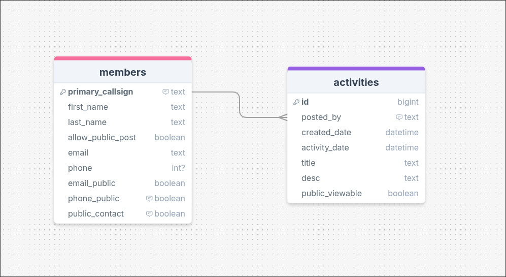
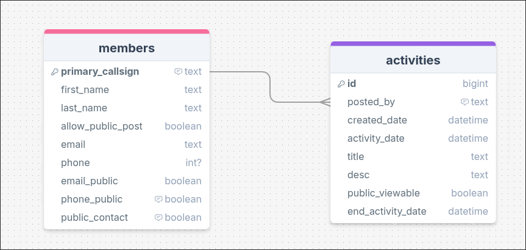
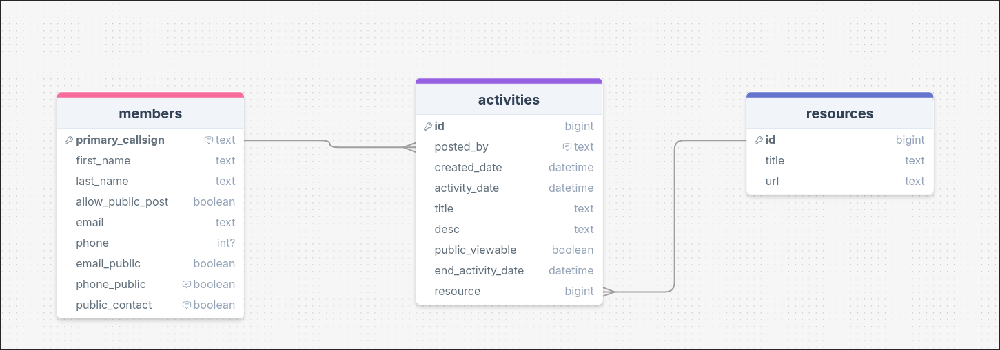
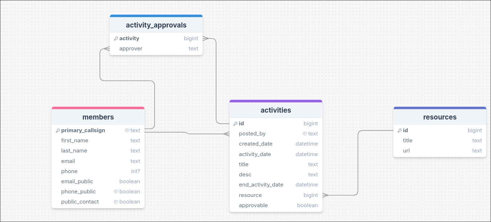

# Sprint 1 - A Working UI Prototype

## Sprint Goals
We are aiming to develop a prototype of how the site looks and feels developing interactions and flow, then elements and colouring for later use in Sprint 2 as it is easier and quicker to make changes in this stage than with html.
We will use Figma as a tool for this stage.
[Figma](https://www.figma.com/) 

---

## Initial Database Design

The database needs to accommodate multiple functions including member login and management of their settings (such as if they want their email or phone to be public). It also needs to show activity details such as the time of the activity and title etc. Each member should be able to publish multiple activities so this is a one to many relationship with members to activities

Showing (and explaining) this straight away to a committee member they said:

> Could there be a way to see how long the activity would last?

This would be a good idea as some activities would only last a few hours like club meetings while others can be much longer.
We could add a running time by:
- Adding a column for running time in hours
- Adding a finish time and date

Adding a finish time and date makes more sense to me as it is the more universal method and allows for more frontend flexibility in how the activity time is entered.

---

## UI 'Flow'

The first stage of prototyping was to explore how the UI might 'flow' between states, based on the required functionality.

This Figma demo shows the initial design for the UI 'flow':

<iframe style="border: 1px solid rgba(0, 0, 0, 0.1);" width="800" height="450" src="https://embed.figma.com/proto/mTFWseUCoYHXODHNIWQgiJ/B26-Flow-v1?scaling=scale-down&content-scaling=fixed&page-id=0%3A1&node-id=1-4&starting-point-node-id=1%3A4&show-proto-sidebar=1&embed-host=share" allowfullscreen></iframe>

### Testing
During the process of thinking of what has to be on each form to move to the UI prototype stage I realised there would be some settings such as email_public and phone_public that are in the members table and relate more to overall prefrences than activities. 

### Changes / Improvements
We can add a page for the members to manage settings such as these in one place like a profile page.

**Figma Demo with Profile Page:**
<iframe style="border: 1px solid rgba(0, 0, 0, 0.1);" width="800" height="450" src="https://embed.figma.com/proto/9kzzt08YjG91j6V8ejnk9Y/B26-Flow-v2?node-id=1-4&p=f&scaling=scale-down&content-scaling=fixed&page-id=0%3A1&starting-point-node-id=1%3A4&embed-host=share" allowfullscreen></iframe>

### Testing 2
We can show this new profile page to the branch committee and see what they think of the flow.
> Changing password info on profile page would be nice.

### Changes / Improvements

We can therefore add a form to the profile page to allow the member to change their password.

---

## Initial UI Prototype

The next stage of prototyping was to develop the layout for each screen of the UI.

This Figma demo shows the initial layout design for the UI:

<iframe style="border: 1px solid rgba(0, 0, 0, 0.1);" width="700" height="450" src="https://embed.figma.com/proto/Xl3VaanWeu43JObAQ7p7Yv/B26-Web-version-one?node-id=1-11&p=f&scaling=scale-down&content-scaling=fixed&page-id=0%3A1&starting-point-node-id=1%3A11&embed-host=share" allowfullscreen></iframe>

### Testing

This UI flow was given to the committee of the branch to establish their thoughts and gain feedback. They were clearly told to not comment on the font and colour choices for this iteration cycle.
There were two main points that came out of this:
> I did have some trouble navigating the site at times, I looked for a Home button (picture of little house) and Back button which would take you back to your previous page. I would like the page you are viewing to be more clear
 - I understand how navigation was confusing as it was not consistent across pages at all. We can also trial adding a bit of skewmorphism with a home icon
> good start. I would like to see a space for loading in information files that can be looked up and down loaded for activities. example "The requirements for Portable Operations"
 - Sometimes there would be a need for uploading documentation associated with an activity, which also may include power point presentations used for club meetings.
> Can we add a page that tells people about the hamcram process?
- Adding a hamcram page could allow us to provide some additional material such as photos/success stories about how we have guided people to pass the GAOC exam.
> Can we ensure the design of the website is modern as many other clubs are aging and we want to put our best foot foward?
- I will investigate this in the Refined UI prototype stage. 

### Changes / Improvements
- Navigation has been made clearer by refining the nav bar by including all accessible options on the top and indicating which page is currently visible.

- I have also added resources page to facilitate accessing resources that have been in historical activities and added a link url to activity form to allow adding activities. However we need a way to keep track of the resources and a way to store them. I initially thought we could store them locally on the machine but this would not work particularly well as hosting on Render does not allow for permanent file storage outside of the project repo. I also considered using a blob type storage and storing these in the Turso database but ultimately there would be no good way to reliably ensure a small file size across many different file types and the sheer amount of data needed for reads and writes would quickly consume our Turso resource allocation. Therefore, we will allow resources to be attached, but only as a reference URL (eg google drive). Our schema now looks like:

We can now add as many resources as we want with their title and url. To have an activity with a resource we just have to add the id of the resource into the activity when creating. From activities to resources this a many to one relationship.

- I have added hamcram page to make it more clear to the public that we can make joining our club an easy process which should make it more attractive. It is a common question we get anyway so it will be good to have some information on it.

- Some committee members also were curious how the public activities system would work and commented that deciding who is allowed to post the activities is a hard process and recommended that I investigate. I came up with the possibility of using an approval based system and the branch committee liked this idea. The problem now is creating it as each activity needs to have more than one member approving it and we don't want to limit the members to only approving one activity at a time so a many to many relationship is required. We can remove the allow_public_post from members as it is redundant as well as changing the public_viewable (bool) column to a better fitting approvable (bool) that allows posting members to create private members only activities where approval is irrelevant.

**Figma Design, with new changes:**
<iframe style="border: 1px solid rgba(0, 0, 0, 0.1);" width="800" height="450" src="https://embed.figma.com/proto/ypTe9rVgLusOHpYu87ikMJ/B26-Web-version-two?node-id=5-22&p=f&scaling=scale-down&content-scaling=fixed&page-id=0%3A1&starting-point-node-id=1%3A11&embed-host=share" allowfullscreen></iframe>

---

## Refined UI Prototype

Now that we have got an idea of what the rough layout of the site is going to be we can create a more refined version. We will create a layout that would more accurately resemble a website in terms of layout and proportion.

This Figma demo shows the UI with refinements applied:

<iframe style="border: 1px solid rgba(0, 0, 0, 0.1);" width="800" height="450" src="https://embed.figma.com/proto/5qha8sqjD7Smjchu6o42q8/Branch-26-refined-v1?node-id=1-2&scaling=scale-down&content-scaling=fixed&page-id=0%3A1&starting-point-node-id=1%3A2&embed-host=share" allowfullscreen></iframe>

### Testing

Replace this text with notes about what you did to test the UI flow and the outcome of the testing.

The Club Committee had some thoughts on seeing the design:
> I like the look overall but it’s a little too plain, maybe add more colour. Blue or green would make it stand out more.
- Yeah alright I can only get away with no colour for so long. This is also a good opportunity to investigate making the design of the site appear modern. 

> On the activities page and profile page the pictures are kind of distracting, my eye keeps going to them instead of the info. The new activity box also feels too small, maybe it could be bigger.
- We can trial removing the images from the profile and activities page which would help reduce clutter but we could also try making the activity form as a different page altogether which makes sense as most traffic to the activities page will be to view all the activities, not to post them.

> There’s a lot of stuff all on the profile page right now, it feels crowded. Could we split it so one page is settings and another is info?
- We can try separating categories on the profile page and spacing them a little which should make it less crowded.

### Changes / Improvements

- We can trial some new colours with realtime colours and easily get some feedback on them. From [Wix blog](https://www.wix.com/blog/modern-website-design) we can see that clean, minimal layouts with consistent and simple colour pallets as well as responsive design that adapts to all devices and has nice looking and feeling interactions and animations is a key part of making a website modern. Combining this with the committee suggestion earlier for a blue or green we will trial a scheme that primarily is dark mode with a green accent. 

I used realtime colours to come up with a quick palette and get feedback.

[Realtime colours palette 1](https://www.realtimecolors.com/dashboard?colors=eef3eb-14180f-b7c9a6-42663d-6aa56e&fonts=Inter-Inter)

On seeing this, the majority of committee members did not like this as they said "the green is not a colour you associate with technology or radio". This makes sense as green is a colour that is mostly found in nature.

We will now trial a blue palette which could be more reminiscent of electricity so could be a better fit.

[Realtime colours palette 2](https://www.realtimecolors.com/dashboard?colors=e6edf1-0d1417-01aaff-493763-a574b1&fonts=Inter-Inter)

**Figma design with colours and updated activities and profile page**
<iframe style="border: 1px solid rgba(0, 0, 0, 0.1);" width="800" height="450" src="https://embed.figma.com/proto/L7jo1eO38HutToJhIqyACF/Branch-26-refined-v2?node-id=1-2&p=f&scaling=scale-down&content-scaling=fixed&page-id=0%3A1&starting-point-node-id=1%3A2&embed-host=share" allowfullscreen></iframe>

---

## Sprint Review

I am happy with how this sprint went as I had several good conversations with the committee which gave me a good idea of what they wanted which resulted in them being happy with the refined prototype in the end. For the purposes of assessment, I would have liked to do some more 'goldilocks' style prototyping but I am happy with the changes I have been able to make.
