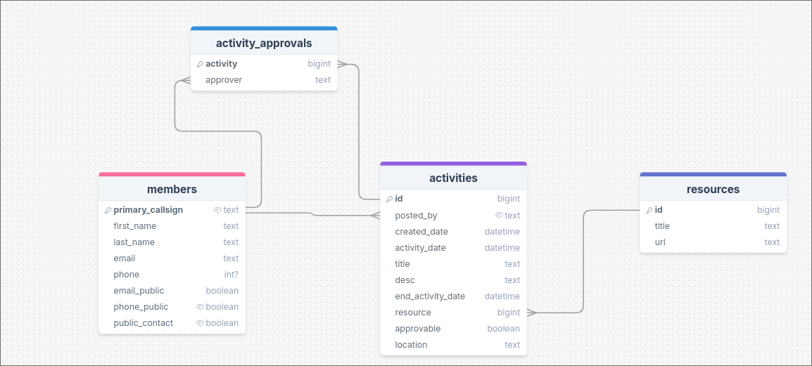
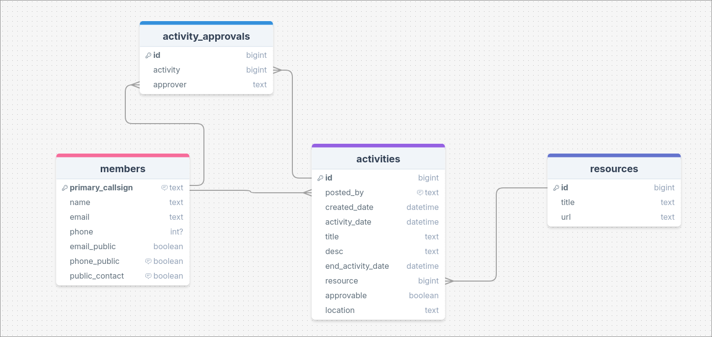
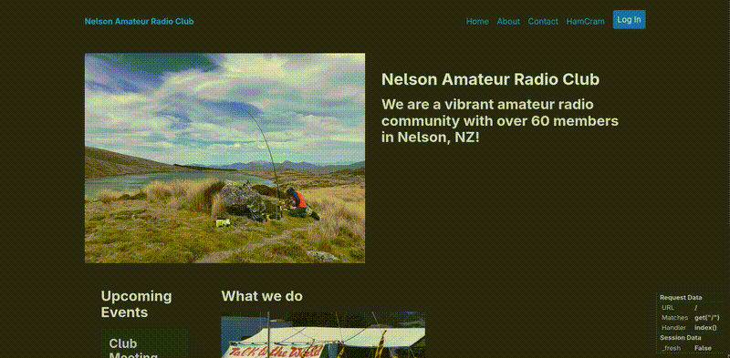
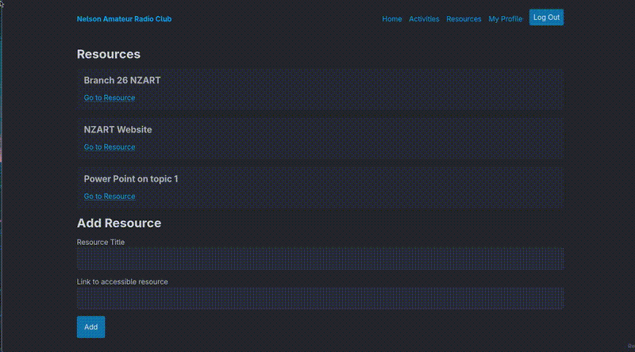
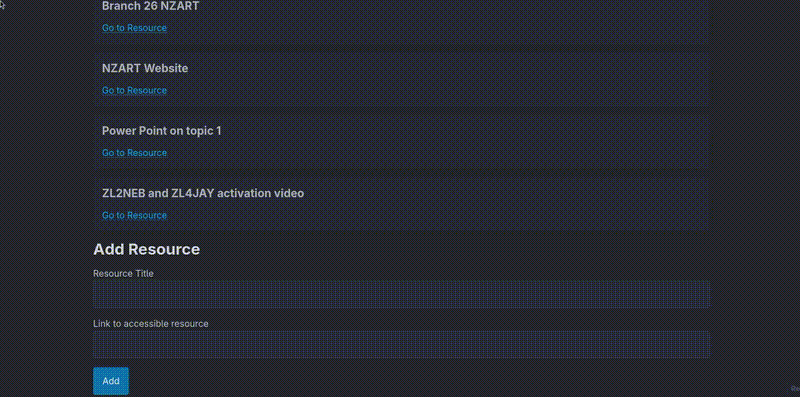
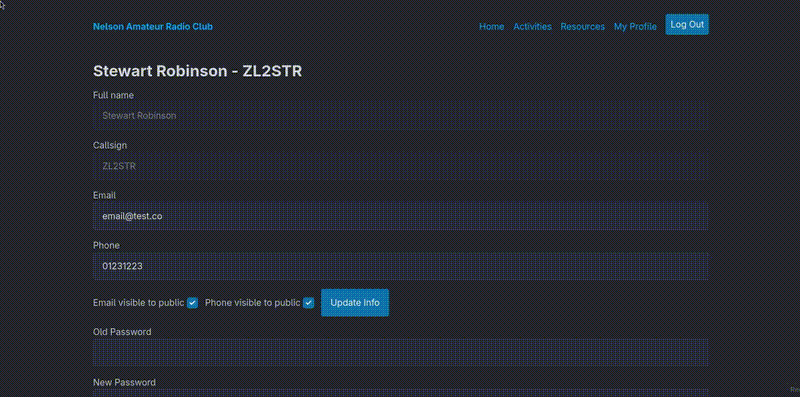
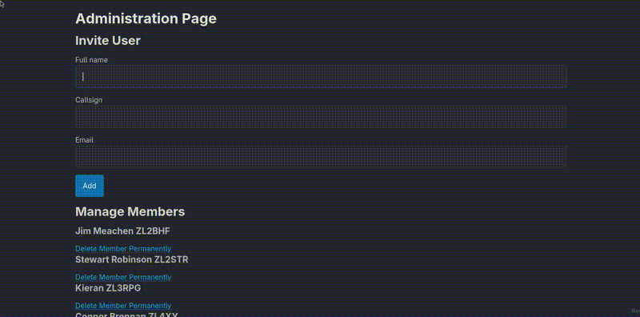
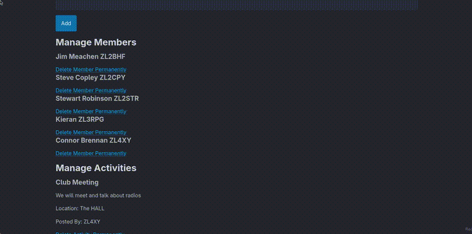
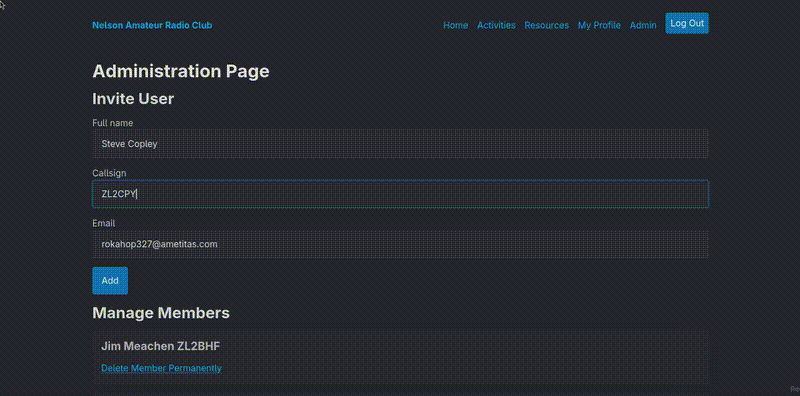
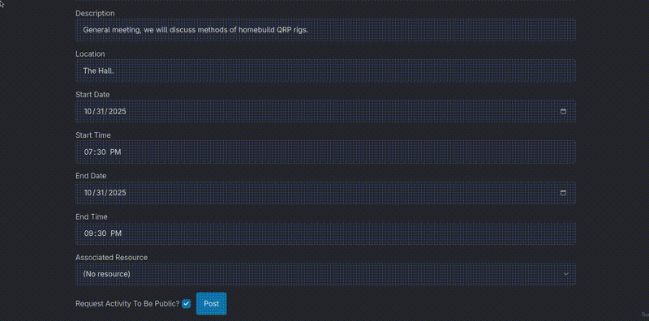

# Sprint 2 - A Minimum Viable Product (MVP)


## Sprint Goals

We need to develop a fully functional website that should implement all of the features that we need but doesn't need the same ui polish as where our refined Figma prototype was as this will come in sprint 3.


---

## Implemented Database Schema

Going into this sprint I also realised we need to add a location column to the activities table as we did not have this before.


Adding location does not affect any other columns so this is a simple change.

---


During making the web app actually functional, I found that whenever I was using the first_name, I would likely be using last_name from my database as well. Due to this, I may as well as combine these two columns to make the schema simpler and handling the user names ever so slightly more simple and efficient. The activity_approvals table also needs an id to be fully functional:



This still works well or even more efficiently for sections such as the profile:

Simplfying this:

```html jinja
<h2>{{user.first_name}} {{user.last_name}} - {{user.callsign}}</h2>

    <section>
      {# Change User Details Form #}
      <form action="/profile/update-info" method="POST">
        First name
        <input 
          type="text"
          disabled
          value="{{user.first_name}}"
          required
        >
        Last name
        <input 
          type="text"
          disabled
          value="{{user.last_name}}"
          required
        >
```

To this:

```html jinja
    <h2>{{user.name}} - {{user.callsign}}</h2>

    <section>
      {# Change User Details Form #}
      <form action="/profile/update-info" method="POST">
        Full name
        <input 
          type="text"
          disabled
          value="{{user.name}}"
          required
        >
```
Which still works perfectly well and is more efficient because we have to fetch less columns from our database for the same outcome:


--- 


## Stakeholder feedback
I also gave this implementation to my stakeholders for them to give feedback on functionality only and they noticed the following

> How do we add and manage members?

I never gave this any thought as the members of the club hardly change so I was planning to update the database manually. 😅
Adding members manually and securely could be hard as passwords would have to be distribute 


---
## Our Testing
We will test the login functionality, logout, adding activities, adding resources, adding members, approving activities, removing activities and resources (committee) and removing members.

---

## Testing Loading member only pages (profile, resources etc)

Logged in members should be able to access the pages but public should not.


We can see that members can load activities, profile, resources pages but when not logged in these pages are not available.

### Changes / Improvements
All functionality is present but some commented that the error page displayed when unauthorized users try to access a login_required page is not user friendly or consistent with the website.
As a result, we can make a specific unauthorised template that is shown in this case and could probably be used to give a specific error message when members are logged in but the fresh_login_required condition is not met.


---

## Testing Adding Activities

Members should be able to use the add activity form on the activities page to add a new activity to the specification that they wish


### Changes / Improvements

I had some difficulty with the current method of selecting activity datetime and to be sure I presented it to the committee and they queried why the date and time were in the same field. Separating the date and time could allow a nicer selection UI, especially using existing libraries in JS but the return that this provides is not worth the investment.

---

## Testing Adding Resources

A logged in user should be able to add a new resource which should then appear on the resources page



### Changes / Improvements

We can see urls can be added to a resource and that these can then be accessed with the link on the resources page. A list of resources are also available to add on the activities page but these are not displayed on the activities themselves yet. Oopsie.

Again refining the display of activities to add a link.




---

## Testing Approving Activity

Activities are an important part of showing the public that we are an active club so ensuring they are correct before displaying them to everyone is a good idea.
Members should not be able to approve an activity that they posted themselves nor should anyone be able to approve an activity twice.
Activities should only show on home page once attained 2 approvals


---


## Testing Admin Page

The Committee need to be able to invite and remove members, and remove activities and resources.

**Unauthorised members should not be able to access the committee page**



**Inviting new member via email**



**Deleting members, activities, and resources**



### Changes / Improvements

I noticed during the inviting members via email process that the members, activities and resources were not showing on submission of this form. Sure enough, there is an error here that rerenders the admin page with no data rather than redirecting.

```python
return render_template("pages/administration.jinja", user=current_user)
```
Change to:

```python
return redirect("/admin")
```
Fixes the issue.

I also showcased this page to members of the committee at the October general meeting and they were impressed with functionality but commented:
> It is hard to see the difference between different members and activities they need to stand out more.

I was using a div for these placed in a section but making the visual heirachy more distinct to seperate the card items involves an article.

**Both of these changes implemented:**


---

## Testing Data Integrity

A slightly complicated element of our database is working with the times of the activities. Sqlite automaticically generates UTC time and it is expected by the computer conventionally as well. Therefore, we should store UTC in our db but most club members would likely prefer working in local time instead so we can convert entered local time from UI to UTC before showing as lt when rendering again:


As expected, the local time is converted to UTC 13 hours behind in the DB before being shifted 13 hours forward again to be displayed.


## Sprint Review

I am thankful that feedback given allowed me to implement adding members which would have probably detracted from key functionality. I am happy where the website is sitting functionality wise and I have received numerous positive comments from club members and others I have shown it to. 
