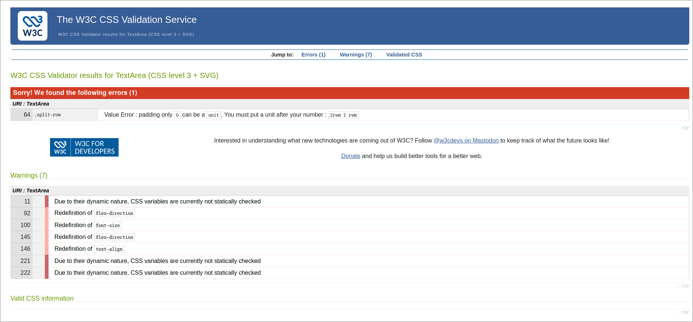

# Sprint 3 - A Refined and Complete System


## Sprint Goals

Develop the system until it is fully featured, with a refined UI and it satisfies the requirements. The system will be fully tested at this point.


---

## Testing with the general public

We will give a demo of the site to some surrounding non-hams and see whether they get a good impression of the amateur radio club.


Navigating through the site a person not familiar to amateur radio said:

> This looks inviting and I want to continue reading more

When asked what a HamCram was afterwards  they were able to answer that it was how they could learn everything get their amateur radio license which shows that they were invited enough by the site.

> The colours seem friendly and the images especially on the hamcram page look friendly and show a wide age range.

I consider this to be a success for the key functionality point of trying to attract the public to our club and amateur radio.

However, they did say that the design felt a bit inconsistent at places which could be distracting.

To help with this we can try and make more generic styling that can apply to a wider range of elements thus we get the same look everywhere.

### Changes / Improvements

On the home page we can see that the h2 heading "upcoming events" is not centered which annoyed my member of the public as well as the Hamcram section on the about page not having a direct link to the hamcram page which they said took them a second to find.


**After Making these changes:**


---


## Testing Accessibility


On the site we consistently use the same azure colour from picocss and a standard white which means that we have to test these two colours as well as gauging their suitability from users to ensure accessibility.


We can see that all of our text scores at least an AA rating, passing the readability test for contrast.

The tabbing order for all pages is also valid but for the activities page has a lot of nodes, but there is little we can do about this as all of these in the dates and time field are required to enter the time. 


---


## Testing Validation

It is best practices to test our CSS and HTML to validate them against best practices and to make sure they have no errors.


> 64 	.split-row 	Value Error : padding only 0 can be a unit. You must put a unit after your number : 2rem 1 rem 

**Testing HTML:**


It passed but for the first time in the entire project looking at the full rendered HTML I saw that the base.jinja has an icon.svg that we use as a tab icon! We can add the NZART Logo like many other branches of NZART because we are apart of the organisation.


### Changes / Improvements


We can fix our css by removing an accidental space :(

```css
.split-row {
    display: flex;
    align-items: center;
    padding: 2rem 1 rem;
    gap: 2rem;
    flex-wrap: wrap;
    flex-direction: row;
}
```

Becomes:
```css
.split-row {
    display: flex;
    align-items: center;
    padding: 2rem 1rem;
    gap: 2rem;
    flex-wrap: wrap;
    flex-direction: row;
}
```

This will now correctly apply the padding whereas before it will not have, slightly decreasing our LR padding.

The warnings regarding redefinition are ignored due to being readable and concise and the variables warning is fine because the validator can't check it.


We can add the icon at `/static/images/icon.png` after downsizing to 177x177px 


---

## Final Implementation

The web app is fully implemented with a refined UI:

(almost all functionality)


## Sprint Review

I would have loved to implement some animations during this sprint unfortunately time has not allowed it. What I have been able to do is take my functional site from the end of sprint 2 and complete it by making it more attractive to our users thereby completing our set of key functionalities. I have done this in a way that meets best practices and accessibility and usability implications by good design decisions and testing and I am proud of this
